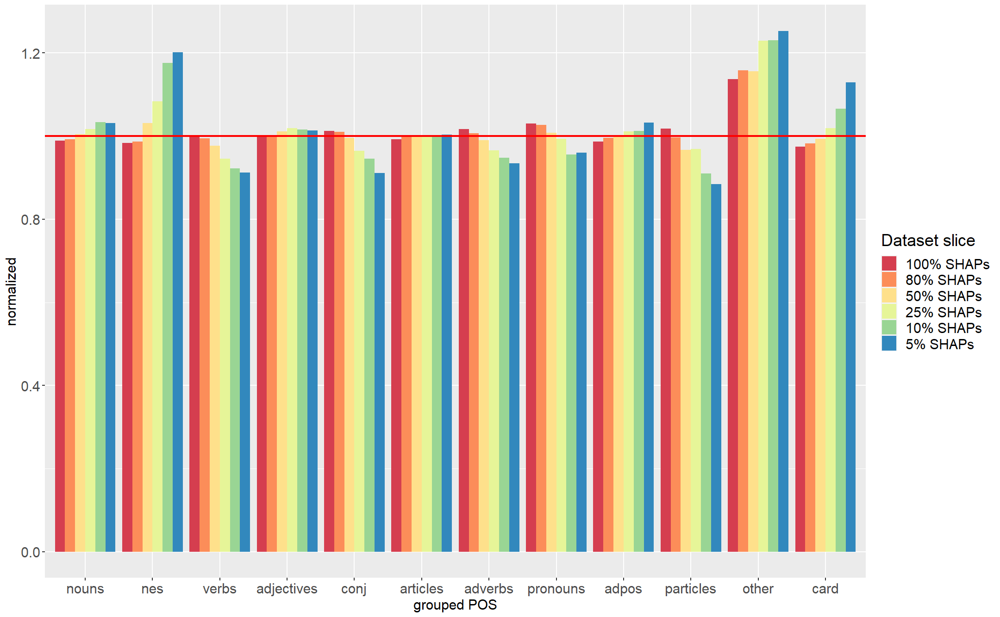

# Linguistics-in-German-BERT
This readme file contains information necessary for the reproducibility of the experiments reported in the paper: "Linguistic Features in German BERT: The Role of Morphology, Syntax, and Semantics in Multi-Class Text Classification", published in the proceedings of the NAACL SRW 2025. 

## Model Training Parameters
The study used the implementation of BERT for German [bert-base-german-cased model](https://huggingface.co/google-bert/bert-base-german-cased).
The model analysed in the study was trained in a 10-fold cross-validation setup with 5 different initializations for further validation. The parameters were left at the default if not reported explicitely.
- Epochs: 5
- Learning-rate: 5e-5
- Batch-size: 8
- Optimizer: AdamW

## Parameters for SHAP-value Calculation

The SHAP values analysed in the paper are calculated using the KernelSHAP algorithm ([Lundberg & Lee, 2017](https://arxiv.org/abs/1705.07874)). 
To employ KernelSHAP on textual input, the TransSHAP library ([Kokalj 2021](https://aclanthology.org/2021.hackashop-1.3/)) is used.
Due to the very long texts in the corpus, which increase the calculation times notably, the data is fed into the explainer in a k-means pooled fashion with k = 8. 
The decision for the number of pools should only have editorial effects, so the number of pools is chosen equivalent to the 8 classes of the classification task.
The reiterations of the KernelExplainer in KernelSHAP are restricted to 200 times and no L1-regularization is applied. 
As the calculation still took a long time, the corpus was split up into 40 parts of equal size SHAP values were calculated separately on each part. 
As the investigation focuses on the influence of words on the classification task, punctuation signs were removed from the 500-word text chunks before handing them over to the explainer.

## Rationale for data selection

The Kernel SHAP algorithm used in for the study calculates a specific value for each word in the full corpus for each classified text. 
When ordering the SHAP values of a specific text numerically, the result is a ranking of the words in the text with respect to their importance to the classification of the text in the assigned classification category. 
A positive value indicates that a word influences the classification decision towards the label in question, a negative value indicates the opposite. 
Since the aim of the study is to identify the features that contribute to a successful classification of a text in the chosen classification task, only positive SHAP values are considered for the analysis. 
In the case of this study, there are 448,894 tokens with a positive SHAP value. This number of values is still quite likely to contain noise, since it includes very high values, as well as values that are close to zero, which would indicate only a minor influence on the classification decision. 
For this reason, a rough exploration was conducted, in order to identify in which slice of positive SHAP values, effects are potentially visible best. 
This exploration was conducted for an easily observable target effect over the full corpus. According to [Kalouli et al. 2022](https://aclanthology.org/2022.coling-1.272/), BERT models have a tendency to rely on NEs, for semantic tasks. 
Since this effect should be very easy to observe, it is chosen as the target measure to identify the slice where effects can be expected to be visible.
The exploration is conducted without distinguishing between classification categories and normalizes POS-features in the different slices of positive SHAP values by their occurrence in the full corpus. 
The exploration considers the top 100%, 80%, 50%, 25%, 10% and 5% of the positive SHAP values. 
The plot of the normalized distributions for POS for the different slices in the Figure below shows that effects of higher representations of NEs in the SHAP values, compared to the SHAP values are nicely visible for the top 10% slice of positive SHAP values, without loosing the effects visible for other POS. 
For this reason, this slice is chosen for the further analysis in the paper.

# Referencing
Please reference the work related to this project and the paper as follows:

[Insert bib info once it is out]
